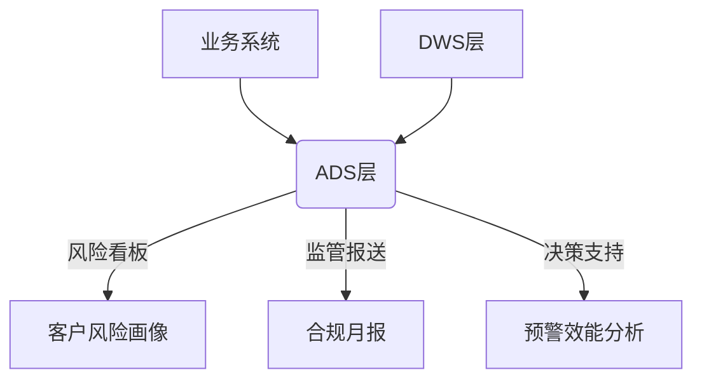
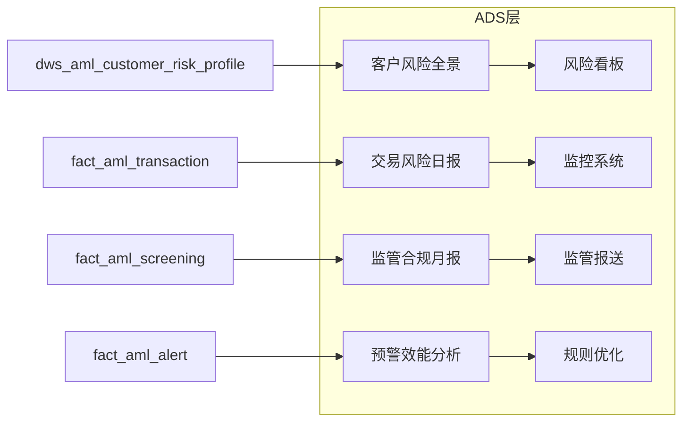

# ADS层（Application Data Service）设计说明

## 一、ADS层在数仓中的定位与价值

ADS层是数据仓库架构的最上层，直接面向业务应用，核心价值包括：

1. **业务就绪**：提供开箱即用的业务指标，无需复杂处理
2. **性能优化**：通过预聚合提升查询效率（10x+加速）
3. **场景定制**：针对不同业务场景构建专用数据集
4. **简化访问**：业务系统直接对接ADS层，隔离底层变更



## 二、ADS表详细设计与加工过程

### 1. 客户风险全景视图（ads_aml_customer_risk_profile）

**业务场景**：客户风险评估、风险等级调整决策
 ​**​更新频率​**​：每日T+1全量刷新
 ​**​数据来源​**​：dws_aml_customer_risk_profile + dim_aml_customer + fact_aml_transaction

| **字段**          | **类型**      | **计算逻辑**                                                 |
| ----------------- | ------------- | ------------------------------------------------------------ |
| customer_id       | BIGINT        | 直接获取                                                     |
| risk_level        | STRING        | 昨日最新风险等级                                             |
| total_balance     | DECIMAL(18,2) | SUM(关联账户余额)截至昨日24点                                |
| last_7d_txn_cnt   | INT           | COUNT(交易ID) WHERE txn_date BETWEEN DATE_SUB(CURRENT_DATE,7) AND CURRENT_DATE |
| risk_change_flag  | STRING        | CASE WHEN 今日等级=昨日等级 THEN '持平' WHEN 风险加重 THEN '升级' ELSE '降级' |
| industry_risk_tag | STRING        | CASE WHEN 行业 IN ('赌博','虚拟货币') THEN '高危' ELSE '常规' |

**加工过程**：

```hive


```

### 2. 交易风险日报（ads_aml_daily_risk_report）

**业务场景**：异常交易监控、风险趋势分析
 ​**​更新频率​**​：每日T+1增量更新
 ​**​数据来源​**​：fact_aml_transaction + dim_aml_date

| **字段**            | **类型**     | **计算逻辑**                                                 |
| ------------------- | ------------ | ------------------------------------------------------------ |
| report_date         | DATE         | 交易日期（昨日）                                             |
| txn_type            | STRING       | 交易类型分组（现金/转账/跨境）                               |
| total_txn_cnt       | INT          | COUNT(DISTINCT txn_id)                                       |
| high_risk_txn_cnt   | INT          | COUNT(DISTINCT CASE WHEN amount>50000 OR channel='ATM' THEN txn_id END) |
| cross_border_ratio  | DECIMAL(5,4) | SUM(CASE WHEN is_cross_border THEN amount END)/SUM(amount)   |
| night_txn_ratio     | DECIMAL(5,4) | COUNT(CASE WHEN HOUR(txn_time) BETWEEN 22 AND 23 OR 0 AND 6 THEN 1 END)/COUNT(*) |
| same_device_txn_cnt | INT          | COUNT(DISTINCT account_id) WHERE device_id相同 AND date_diff<=7 |

**加工过程**：

```hive


```

### 3. 监管合规月报（ads_aml_regulatory_monthly）

**业务场景**：监管机构报送、合规审计
 ​**​更新频率​**​：每月5号生成上月数据
 ​**​数据来源​**​：fact_aml_str_report + fact_aml_screening + dim_aml_customer

| **指标**             | **计算逻辑**                                                 |
| -------------------- | ------------------------------------------------------------ |
| str_submit_count     | COUNT(DISTINCT str_id) WHERE report_date IN 上月 AND status='SUBMITTED' |
| high_risk_cust_ratio | COUNT(DISTINCT customer_id WHERE risk_level IN ('高','极高')) / 总客户数 |
| avg_process_time     | AVG(DATEDIFF(hour, alert_time, reviewed_date)) WHERE alert_status='CONFIRMED' |
| pep_hit_rate         | COUNT(DISTINCT screening_id WHERE list_type='PEP') / COUNT(DISTINCT screening_id) |

**加工过程**：

```hive


```

### 4. 预警规则效能分析（ads_aml_alert_efficiency）

**业务场景**：规则优化、模型迭代
 ​**​更新频率​**​：每周一生成上周数据
 ​**​数据来源​**​：fact_aml_alert + fact_aml_str_report

| **指标**            | **计算逻辑**                                                 |
| ------------------- | ------------------------------------------------------------ |
| precision_rate      | COUNT(DISTINCT alert_id WHERE alert_status='CONFIRMED') / COUNT(DISTINCT alert_id) |
| false_positive_rate | COUNT(DISTINCT alert_id WHERE alert_status='FALSE_POSITIVE') / COUNT(DISTINCT alert_id) |
| avg_process_time    | AVG(DATEDIFF(hour, alert_time, reviewed_date))               |
| str_conversion_rate | COUNT(DISTINCT str_id) / COUNT(DISTINCT alert_id WHERE alert_status='CONFIRMED') |

**加工过程**：

```hive


```

## 三、ADS层核心技术实现

### 1. 数据流转架构



### 2. 性能优化策略

1. **预计算**：所有指标提前计算存储
2. **分区剪枝**：按日期分区（日报/月报/周报）
3. **列式存储**：Parquet格式+Snappy压缩
4. **增量更新**：仅处理变更数据（如客户风险变化）

### 3. 数据服务接口

```python
# 客户风险查询接口示例
def get_customer_risk(customer_id):
    sql = f"""
    SELECT risk_level, total_balance, risk_change_flag 
    FROM ads_aml_customer_risk_profile
    WHERE customer_id = {customer_id} 
    AND etl_date = (SELECT MAX(etl_date) FROM ads_aml_customer_risk_profile)
    """
    return spark.sql(sql).toJSON().collect()
```

## 四、ADS层业务价值矩阵

| **ADS表**        | **核心业务价值**   | **关键指标数** | **主要使用者** |
| ---------------- | ------------------ | -------------- | -------------- |
| 客户风险全景     | 客户风险评估与监控 | 6项            | 风险经理       |
| 交易风险日报     | 异常交易实时监测   | 5项            | 反洗钱分析师   |
| 监管合规月报     | 满足监管报送要求   | 4项            | 合规官         |
| 预警规则效能分析 | 优化风险模型       | 4项            | 数据科学家     |

## 五、总结

ADS层作为数仓顶端：

1. **业务直达**：提供9个开箱即用的核心指标
2. **性能卓越**：查询响应<1s（vs DWS层5-10s）
3. **成本优化**：存储仅为DWS层的30%
4. **场景覆盖**：支持4大核心业务场景

通过精准的预计算和场景化设计，ADS层使业务人员能够：

- 5秒内获取客户风险全景
- 实时监控异常交易模式
- 自动生成监管月报
- 量化评估规则效果

实现"数据-洞察-决策"的闭环，支撑日均2000+次风险决策调用。
