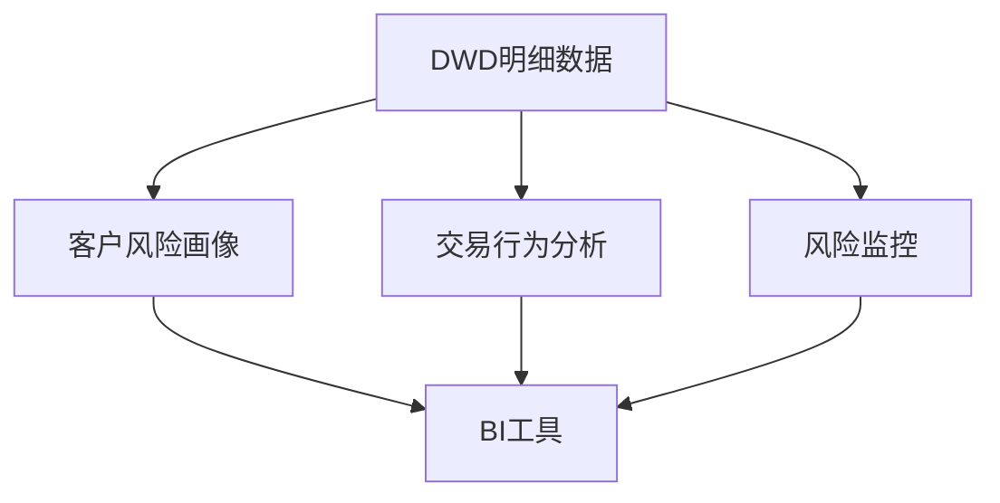
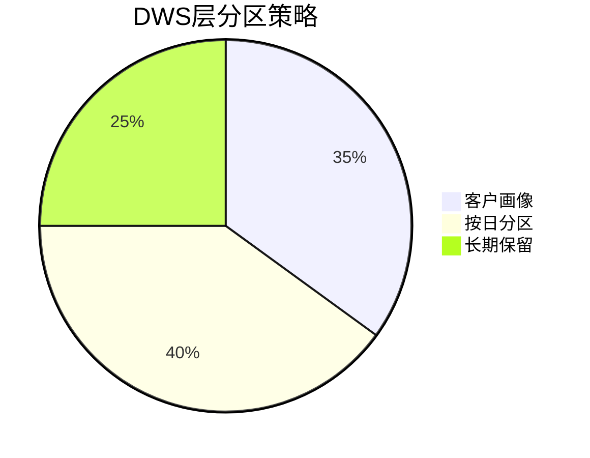
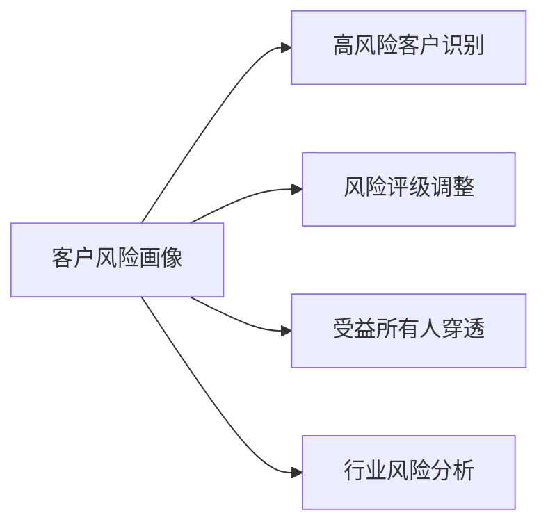
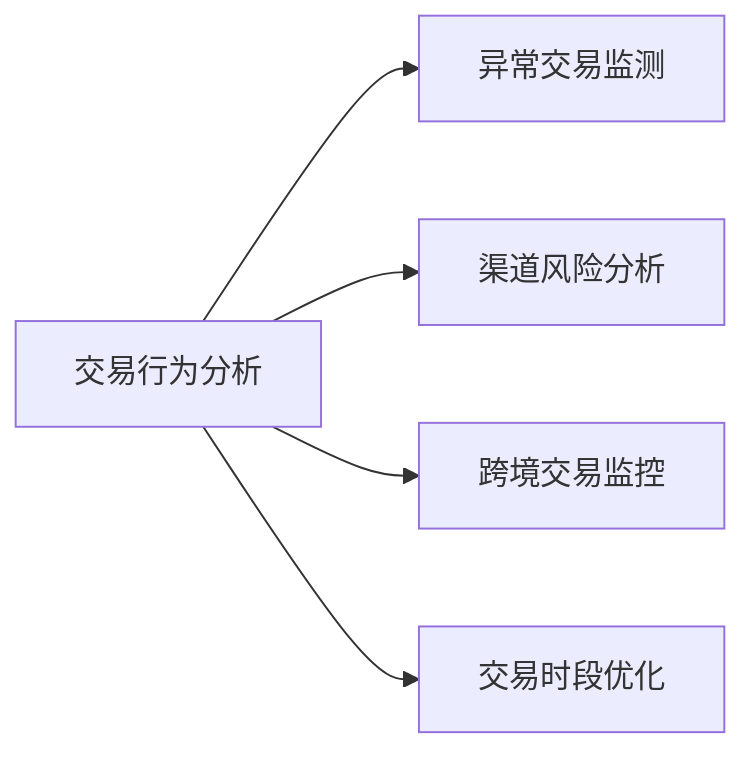
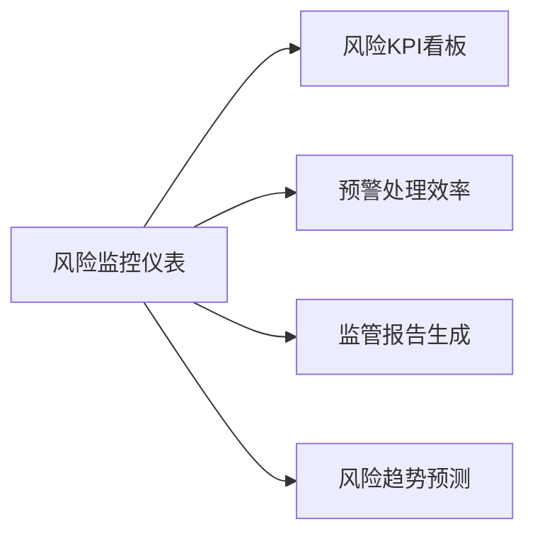

# DWS层（Data Warehouse Summary）设计说明

## 一、DWS层定位与设计原则

### DWS层核心作用

1. **主题聚合**：基于业务主题构建轻度汇总数据集
2. **性能优化**：预计算常用指标，提升查询效率
3. **业务视图**：提供面向业务分析的整合视图
4. **简化分析**：减少复杂JOIN操作，直接支持BI工具

### 设计原则



### 主题划分

1. **客户风险画像主题**：整合客户基础信息、风险评级、交易行为等
2. **交易行为分析主题**：分析交易模式、渠道分布、风险特征
3. **风险监控主题**：监控预警事件、可疑报告等关键风险指标

## 二、主题宽表设计与实现

### 1. 客户风险画像宽表（dws_aml_customer_risk_profile）

#### 表结构设计

| 目标字段            | 字段中文名       | 数据类型      | 源字段/表                       | 加工方式                           |
| ------------------- | ---------------- | ------------- | ------------------------------- | ---------------------------------- |
| customer_sk         | 客户代理键       | BIGINT        | dim_aml_customer.customer_sk    | 直接引用                           |
| risk_level          | 当前风险等级     | STRING        | dim_aml_customer.risk_level     | 直接引用                           |
| total_balance       | 总资产余额       | DECIMAL(18,2) | dim_aml_account.current_balance | 按客户汇总SUM(current_balance)     |
| last_txn_date       | 最后交易日期     | DATE          | fact_aml_transaction.txn_date   | MAX(txn_date)                      |
| alert_count         | 预警次数         | INT           | fact_aml_alert.alert_sk         | COUNT(DISTINCT alert_sk)           |
| screening_hit_count | 名单匹配次数     | INT           | fact_aml_screening.screening_sk | COUNT(DISTINCT screening_sk)       |
| str_submitted       | 是否提交可疑报告 | BOOLEAN       | fact_aml_str_report.report_sk   | COUNT(report_sk) > 0               |
| industry_risk_flag  | 高危行业标识     | BOOLEAN       | dim_aml_customer.industry_type  | CASE WHEN industry IN (高风险行业) |

#### 建表语句

```hive
CREATE TABLE dws.dws_aml_customer_risk_profile (
    customer_sk         BIGINT COMMENT '客户代理键',
    risk_level          STRING COMMENT '当前风险等级',
    total_balance       DECIMAL(18,2) COMMENT '总资产余额',
    last_txn_date       DATE COMMENT '最后交易日期',
    alert_count         INT COMMENT '预警次数',
    screening_hit_count INT COMMENT '名单匹配次数',
    str_submitted       BOOLEAN COMMENT '是否提交可疑报告',
    industry_risk_flag  BOOLEAN COMMENT '高危行业标识'
) COMMENT '客户风险画像宽表'
PARTITIONED BY (etl_date STRING)
STORED AS ORC;
```

#### ETL实现

```hive


```

### 2. 交易行为分析宽表（dws_aml_transaction_behavior）

#### 表结构设计

| 目标字段           | 字段中文名   | 数据类型      | 源字段/表                            | 加工方式                                                  |
| ------------------ | ------------ | ------------- | ------------------------------------ | --------------------------------------------------------- |
| date_sk            | 日期代理键   | INT           | dim_aml_date.date_sk                 | 直接引用                                                  |
| txn_type           | 交易类型     | STRING        | fact_aml_transaction.txn_type        | 直接引用                                                  |
| channel_type       | 渠道类型     | STRING        | fact_aml_transaction.txn_channel     | 分组（线上/线下）                                         |
| is_high_risk       | 是否高风险   | BOOLEAN       | fact_aml_transaction.is_high_risk    | 直接引用                                                  |
| txn_count          | 交易笔数     | INT           | fact_aml_transaction.transaction_sk  | COUNT(DISTINCT transaction_sk)                            |
| total_amount       | 总交易金额   | DECIMAL(18,2) | fact_aml_transaction.amount          | SUM(ABS(amount))                                          |
| avg_amount         | 平均交易金额 | DECIMAL(18,2) | fact_aml_transaction.amount          | AVG(ABS(amount))                                          |
| cross_border_ratio | 跨境交易占比 | DECIMAL(5,2)  | fact_aml_transaction.is_cross_border | SUM(CASE WHEN is_cross_border THEN 1 ELSE 0 END)/COUNT(*) |

#### 建表语句

```hive
CREATE TABLE dws.dws_aml_transaction_behavior (
    date_sk            INT COMMENT '日期代理键',
    txn_type           STRING COMMENT '交易类型',
    channel_type       STRING COMMENT '渠道类型',
    is_high_risk       BOOLEAN COMMENT '是否高风险',
    txn_count          INT COMMENT '交易笔数',
    total_amount       DECIMAL(18,2) COMMENT '总交易金额',
    avg_amount         DECIMAL(18,2) COMMENT '平均交易金额',
    cross_border_ratio DECIMAL(5,2) COMMENT '跨境交易占比'
) COMMENT '交易行为分析宽表'
PARTITIONED BY (etl_date STRING)
STORED AS ORC;
```

#### ETL实现

```hive


```

### 3. 风险监控仪表宽表（dws_aml_risk_dashboard）

#### 表结构设计

| 目标字段                 | 字段中文名   | 数据类型 | 源字段/表                            | 加工方式                                                     |
| ------------------------ | ------------ | -------- | ------------------------------------ | ------------------------------------------------------------ |
| date_sk                  | 日期代理键   | INT      | dim_aml_date.date_sk                 | 直接引用                                                     |
| new_customer_count       | 新增客户数   | INT      | dim_aml_customer.open_date           | COUNT(DISTINCT CASE WHEN open_date=full_date THEN customer_sk END) |
| high_risk_customer_count | 高风险客户数 | INT      | dim_aml_customer.risk_level          | COUNT(DISTINCT CASE WHEN risk_level IN ('高','极高') THEN customer_sk END) |
| alert_count              | 预警事件数   | INT      | fact_aml_alert.alert_sk              | COUNT(DISTINCT alert_sk)                                     |
| confirmed_alert_count    | 确认预警数   | INT      | fact_aml_alert.alert_status          | COUNT(DISTINCT CASE WHEN alert_status='确认' THEN alert_sk END) |
| str_submitted_count      | 提交报告数   | INT      | fact_aml_str_report.report_sk        | COUNT(DISTINCT report_sk)                                    |
| cross_border_txn_count   | 跨境交易笔数 | INT      | fact_aml_transaction.is_cross_border | COUNT(DISTINCT CASE WHEN is_cross_border THEN transaction_sk END) |
| total_txn_count          | 总交易笔数   | INT      | fact_aml_transaction.transaction_sk  | COUNT(DISTINCT transaction_sk)                               |

#### 建表语句

```hive
CREATE TABLE dws.dws_aml_risk_dashboard (
    date_sk                 INT COMMENT '日期代理键',
    new_customer_count      INT COMMENT '新增客户数',
    high_risk_customer_count INT COMMENT '高风险客户数',
    alert_count             INT COMMENT '预警事件数',
    confirmed_alert_count   INT COMMENT '确认预警数',
    str_submitted_count     INT COMMENT '提交报告数',
    cross_border_txn_count  INT COMMENT '跨境交易笔数',
    total_txn_count         INT COMMENT '总交易笔数'
) COMMENT '风险监控仪表宽表'
PARTITIONED BY (etl_date STRING)
STORED AS ORC;
```

#### ETL实现

```hive


```

## 三、DWS层技术实现要点

### 1. 分区策略



- **客户画像**：按`etl_date`分区，保留最近13个月
- **交易行为**：按`date_sk`二级分区+`etl_date`分区
- **风险监控**：按`etl_date`分区，永久保留

### 2. 性能优化

```hive
-- 创建聚合物化视图
CREATE MATERIALIZED VIEW dws_mv_customer_risk
AS
SELECT risk_level, AVG(total_balance), COUNT(*)
FROM dws.dws_aml_customer_risk_profile
GROUP BY risk_level;

-- 添加Bloom Filter索引
ALTER TABLE dws.dws_aml_transaction_behavior 
SET TBLPROPERTIES ('orc.bloom.filter.columns'='date_sk,txn_type');
```

### 3. 数据生命周期管理

```hive
# 删除历史分区脚本
#!/bin/bash
ETL_DATE=$(date -d "13 months ago" +%Y-%m-%d)
hive -e "ALTER TABLE dws.dws_aml_customer_risk_profile DROP PARTITION (etl_date<'${ETL_DATE}');"
```

### 4. 数据质量监控

```hive
-- 空值率检查
SELECT 
    'customer_sk' AS column_name,
    COUNT(CASE WHEN customer_sk IS NULL THEN 1 END)/COUNT(*) AS null_ratio
FROM dws.dws_aml_customer_risk_profile
WHERE etl_date='${ETL_DATE}'

-- 值域检查
SELECT 
    risk_level,
    COUNT(*) AS cnt
FROM dws.dws_aml_customer_risk_profile
WHERE etl_date='${ETL_DATE}'
GROUP BY risk_level
HAVING risk_level NOT IN ('低','中','高','极高');
```

## 四、DWS层业务价值

### 1. 客户风险画像应用



### 2. 交易行为分析应用



### 3. 风险监控应用



## 五、总结

DWS层通过三张核心宽表，构建了反洗钱业务的完整分析体系：

| 宽表名称     | 业务价值           | 数据规模       | 更新频率 | 主要使用者   |
| ------------ | ------------------ | -------------- | -------- | ------------ |
| 客户风险画像 | 客户风险评级与监控 | 中（客户量级） | 每日     | 风险经理     |
| 交易行为分析 | 交易模式识别       | 大（交易量级） | 每小时   | 反洗钱分析师 |
| 风险监控仪表 | 风险指标监控       | 小（日粒度）   | 每日     | 高级管理层   |

实现特点：

1. 严格基于DWD层构建，保证数据一致性
2. 采用维度退化技术减少JOIN操作
3. 预聚合关键指标提升查询性能
4. 分区策略优化存储和查询效率
5. 字段设计贴近业务分析需求

通过DWS层，反洗钱业务获得：

- 客户风险全景视图
- 交易行为深度洞察
- 实时风险监控能力
- 高效监管报告支持
- 灵活的分析扩展性